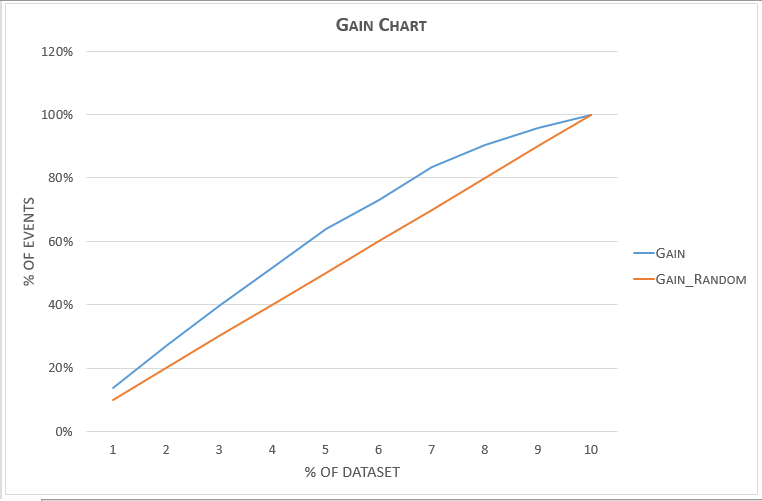
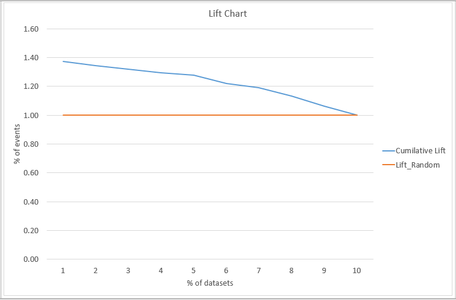

```{r setup, include=FALSE}
library(ggplot2)
library(MASS)
library(pROC)
library(DescTools)
knitr::opts_chunk$set(echo = TRUE)
```
## Data preparataion
Here we take the "take offer" as the positive outcome. 
```{r}
mort <- read.csv("sagedat2.csv",stringsAsFactors = FALSE)
mort$resp[mort$takeoffer == "take offer"] <- 1
mort$resp[mort$takeoffer == "decline offer"] <- 0
```

# Question 1 : Comparing Logit and Probit
## Logit equation
The logit fuction uses the following link equation : 
$$ f(\mu_{Y}) = \ln\bigg(\frac{P}{1-P}\bigg)$$ 
It can transform $\log(odds)$ to odds ratio. 
## Probit Equation
The probit function uses the following link equation as given below:
$$ f(\mu_{Y}) = \Phi^{-1}(P)$$
It can be interpreted as the inverse normal CDF.

## Logit model
```{r}
m1.logit <- glm(data=mort, resp~Mortgage+Famsize, 
                family=binomial(link = "logit"))
exp(m1.logit$coefficients)
```
## Probit model
```{r}
m1.probit <- glm(data=mort, resp~Mortgage+Famsize,  
                 family = binomial(link = "probit"))
exp(m1.probit$coefficients)
```
## Difference between the two models
```{r echo=FALSE}
# Comparing logit and probit
result<-data.frame("x"=seq(1:nrow(mort)),
                   "logit.prob"=sort(predict(m1.logit, type="r"),decreasing=TRUE), 
                   "probit.prob"=sort(predict(m1.probit, type="r"),decreasing=TRUE),
                   "logit.greater"= (predict(m1.logit, type = "r")>predict(m1.probit, 
                                                                           type = "r")))

library(ggplot2)
p<-ggplot(data = result, aes(x)) + 
  geom_line(aes(y = logit.prob, colour = "Logit link")) + 
  geom_line(aes(y = probit.prob, colour = "Probit link"))
p + ggtitle("Comparing Logit and Probit links") +
  xlab("No. of Trials") + ylab("Probability")  

```
As can be noticed there's not much of a difference between the logit and probit probabilities. 


# Question 2: Switching the response variable
## Data Preparation
Here we take the "decline offer" as the response variable.
```{r}
mort2 <- read.csv("sagedat2.csv",stringsAsFactors = FALSE)
mort2$resp[mort$takeoffer == "take offer"] <- 0
mort2$resp[mort$takeoffer == "decline offer"] <- 1
```
## Data Model
This model gives us teh probability of decling the offer. 
```{r}
m2.logit <- glm(data=mort2, resp~Mortgage+Famsize, family=binomial(link = "logit"))
exp(m2.logit$coefficients)
predict(m2.logit,type = "r")
```
## Getting back original probabilities
We can get the original model probabilities for "take offer" by $ 1-P("decline offer")$ as the sum of the two probabilities is 1.
```{r}
(predict(m1.logit,type = "r"))+(predict(m2.logit, type="r"))
```
## Relation between the coefficients
The product of the exponentials of the coefficients between the two models is equal to one.
```{r}
#Product of coefficients
exp(m1.logit$coefficients)*exp(m2.logit$coefficients)
```


# Question : German Credit Data

## Data preparation
First we remove unwanted columns and code the correct attibutes so that we can undersstan the data. Here if the response is "1" mean good credit risk. 
```{r}
german<-read.table("german.data",header = FALSE)
german[,6:20]<-NULL
names(german)<-c("Account Status","Duration in month","Credit history","Purpose","Credit Amount","Response")
german$Response[german$Response == 2] <- 0 #Bad
german$Response[german$Response == 1] <- 1 #Good
levels(german$`Account Status`)<-c("< 0 DM","Between 0-200 DM",">= 200 DM","no checking")
levels(german$`Credit history`)<-c("no credits taken","all paid back duly","existing paid back duly",
                                   "delay in paying","critical account")
levels(german$Purpose)<-c("new car","used car","others","furniture","radio/television","domestic appliances",
                          "repairs","education","retraining","business")

```

## Univariate Analysis
```{r}
table(german$Response)
```

## Bivariate Analysis
```{r , echo=FALSE}
Response.Vs.Account_Status <-table(german$Response,german$`Account Status`) 
r1 <-plot(Response.Vs.Account_Status, col=rainbow(4), las=1)
```

```{r , echo=FALSE}
Response.Vs.Credit_History <-table(german$Response,german$`Credit history`) 
r2 <-plot(Response.Vs.Credit_History, col=rainbow(5), las=1)
```

```{r , echo=FALSE}
Response.Vs.Purpose <-table(german$Response,german$Purpose) 
r3 <-plot(Response.Vs.Purpose, col=rainbow(10), las=1)
```

## Data Splitting
we use a 70:30 split.
```{r}
train.index <- sample(1:nrow(german), nrow(german)*.7)
train.german <- german[train.index,]
test.german <- german[-train.index,]
```

## Data Modeling
We use the step function to get the parsimonioous model with lowest AIC score. A summary of the model is given below.
```{r}

fullmodel <- glm(data=train.german, Response~., family=binomial(link = "logit"))
zeromodel <- glm(data=train.german, Response~1, family=binomial(link = "logit"))
stepmodel <-  step(zeromodel, list(lower=formula(zeromodel),
                                   upper=formula(fullmodel)),
                                   direction="both",trace=0)

summary(stepmodel)

m3<-glm(formula = Response ~ `Account Status` + `Duration in month` + 
             `Credit history` + Purpose, family = binomial(link = "logit"), 
           data = train.german)
```

## Model Interpretation
The probability of a customer being a good credit risk is a function of "Account Status", "Duration in Month", "Credit History" and "Purpose". The multiplicative factor for each of the Xs is given below.
```{r}
exp(m3$coefficients)
```

## Model Validation

### Confusion Matrix
```{r}
train.german$prob <- predict(m3,type="r")
CUTOFF <- quantile(train.german$prob,.65)

train.german$pred <- ifelse(train.german$prob > CUTOFF,1,0)
table(train.german$pred, train.german$Response)
#Conf(x = train.german$pred,ref=train.german$Response)

test.german$pred <- ifelse(predict(m3, test.german)>CUTOFF,1,0)
table(test.german$pred, test.german$Response)
#Conf(x = test.german$pred,ref=test.german$Response)
```
### ROC chart
```{r}
train.german$prob <- predict(m3,type="r")
plot(roc(train.german$Response, train.german$prob, direction="<"),
     col="blue", lwd=3, main="Tradeoff")

test.german$prob <- predict(m3,test.german, type="r")
plot(roc(test.german$Response, test.german$prob, direction="<"),
     col="red", lwd=3, main="Tradeoff")
```


## Lift and Gain Chart


  


