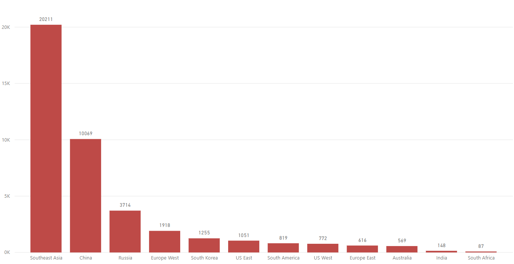
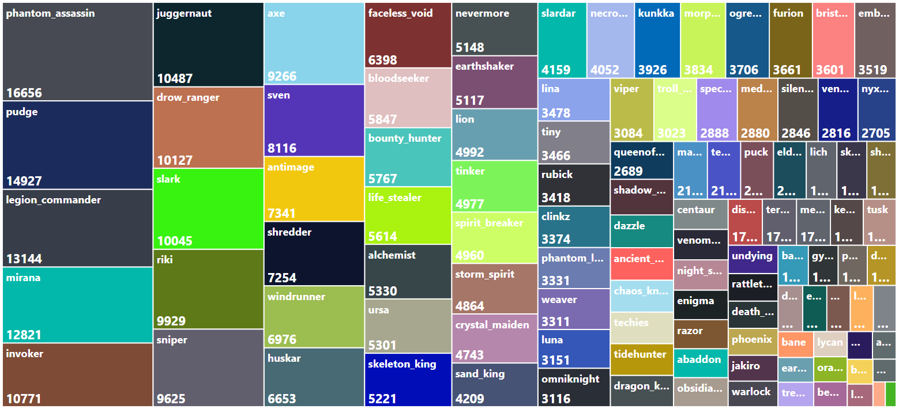

```{r setup, include=FALSE}
dota2<-read.csv("dota2_final_v0.csv", colClasses = "factor")
dota2.hero<-dota2
dota2.hero$region<-NULL
library(pROC)
library(MASS)
library(ggplot2)
library(lattice)
library(caret)
library(pscl)
library(ResourceSelection)
library(DescTools)
knitr::opts_chunk$set(echo = TRUE, fig.cap = "")
```

# Introduction

  The World Economic Forum projects eSports (Electronic Sports) industry to reach $1.4 billion by 2020. The growing popularity of eSports has also cought the attention of social media sites like YouTube and Twitch, which has recetly started live gaming streams to capture this market. One of the major eSports tounament covered is annual DoTA2 tournament "The International" with a total prize money worth around \$20 million in 2016. With this context we plan to build a logistic regression model to predict the probability of winnig a DoTA2 game given the hero selection by the teams.

  DoTA2 is a popular MOBA (Multiplayer online battle arena) game. The gameplay consists of two teams with 5 players each. The games obejective is to select and control appropriate heros from a selection and defeat the other team. The heros chosen by the teams are mutually exclusive. For the present problem we use the data obtained from the UCI Machine learning repository. The data  was collected on the last day of the "The International" tournament held on the $13^{th}$ of August 2016 within a span of two hours using the API provided by the game developers.

# Data Cleaning

  For our convenience we will use only the data corresponding to the game type as "Tournament" and game mode as "Captains Mode". This data is composed of 41,229 rows. Further we decoupled the hero selections for the two teams into two set of 111 each for each side. The cell value of 1 indicates that the hero is chosen while 0 indicates not choosing. The hero names prefixed with "Choose" indicate the team whose result we are interested in while those hero names prefixed with "find" indicate the opposing team selecctions.

  The majority of the data cleaning ws carried out in Microsoft Excel. Also the region column had to be converted from integer to a string to increase readability. See Appendix 1 for the structure of the dataframe.

# Exploratory Data Analysis
## Win/Loss Count
  First, we would like to know the distribution of the games in terms of win/loss. 
```{r echo=FALSE}
table(dota2$result)  
```
We can see that the win/loss is evenly distributed in our dataset. Next, we would like to know how the games are spread over the different server regions.

## Geographical Distribution

  
  We can see that a majority of the games are played in Southeast Asia. The second highest number of games are played in China nearly half the number of games in Southeast asia. Both these regions together account for around 70% of the games in our dataset, hence our results might be relevant to this geographical setting.
  
## Heroes by popularity


The top five most selected characters are Phantom Assasin, Pudge, Legion Commander, Mirana and Invoker respectively. Also another point to note is that a few characters are disproportionately used more frequently than the majority which is used relatively less frequently. 

# Modelling

## Data Splitting

In order to test our model we split it into a train and a test group using 80:20 split. 
```{r}
set.seed(999)
train.index <- sample(1:nrow(dota2.hero), nrow(dota2.hero)*.8)
train.dota2 <- dota2.hero[train.index,]
test.dota2 <- dota2.hero[-train.index,]
```

## Step Model

In order to use the step modeling procedure, we first create a base model with no independent variables and a full mode with all the independent variables. We then use these models to iteratively build models using a combination of the inputs and minimizing the AIC score of the resultant model. 

```{r}
fullmodel <- glm(data=train.dota2, result~., family=binomial)
zeromodel <- glm(data=train.dota2, result~1, family=binomial)
#This step takes a long time to process and commented
#stepmodel <-  step(zeromodel, list(lower=formula(zeromodel),
                                  #upper=formula(fullmodel)),
                                    #direction="both",trace=0)
```

We finally arrive at the parsimonious model as suggested with an AIC score of 45520. The model coefficients are shown below. The coefficients with positive sign contribute towards winning while the coefficients with negative sign contribute towards the loosing. 

```{r}
m3<-glm(formula = result ~ find_furion + choose_skeleton_king + choose_furion + 
          find_oracle + choose_nevermore + choose_morphling + choose_shadow_demon + 
          choose_omniknight + choose_witch_doctor + choose_invoker + 
          choose_mirana + find_lion + choose_pudge + find_pudge + choose_earth_spirit + 
          choose_leshrac + choose_obsidian_destroyer + find_ogre_magi + 
          find_ancient_apparition + choose_wisp + choose_rattletrap + 
          find_faceless_void + choose_rubick + find_phantom_assassin + 
          choose_visage + find_weaver + choose_spectre + choose_clinkz + 
          find_omniknight + find_techies + find_riki + find_chaos_knight + 
          choose_lion + choose_disruptor + choose_bane + choose_luna + 
          find_spectre, family = binomial, data = train.dota2)
m3$coefficients
```

## Model Variables
We can see individual contribution each of the significant variables make towards the odds of winning. Choosing Wisp has the highest contribution (increases odds by 1.44 times) while finding Furion in the opponent's team reduces your odds of winning by 0.733 times (the lowest contribution) .
```{r}
exp(m3$coefficients)
```

# Model Evaluation

## Training Data

### ROC Chart 
Firstly we would like to construct a confusion matrix to have an idea of the type 1 and type 2 errors. For this wewould like to first the ROC chart for the  training dataset. 
```{r echo= FALSE}
train.dota2$prob <- predict(m3,type="r")
plot(roc(train.dota2$result, train.dota2$prob, direction="<"),
     col="blue", lwd=3, main="Tradeoff")
```
From the tradeoff graph we observe that our model is performing better than the zero model (no independent variables) albeit only marginally. By visual inspection we find that a cutoff value of 0.5 gives us the mazimum sensitivity and specficity.

### Confusion Matrix
Below shown is the specificity and sensitivity values for a cutoff value of 0.5 in the training data.
```{r}
CUTOFF <- quantile(train.dota2$prob,0.5)
train.dota2$pred <- ifelse(train.dota2$prob > CUTOFF,1,0)
table(train.dota2$pred, train.dota2$result)
Conf(x = train.dota2$pred,ref=train.dota2$result, pos = 1)
```


## Test data

### ROC Chart 
There's only a minute improvement in performance. This raises concerns about the variables taken into the model. 
```{r echo= FALSE}
test.dota2$prob <- predict(m3,test.dota2,type="r")
plot(roc(test.dota2$result, test.dota2$prob, direction="<"),
     col="red", lwd=3, main="Tradeoff")
```

### Confusion Matrix
The sensitivity and specificity values are almost similar to the training case.
```{r}
CUTOFF <- quantile(test.dota2$prob,0.5)
test.dota2$pred <- ifelse(test.dota2$prob > CUTOFF,1,0)
table(test.dota2$pred, test.dota2$result)
Conf(x = test.dota2$pred,ref=test.dota2$result, pos = 1)
```


# Model Accuracy

```{r}
mean(test.dota2$pred == test.dota2$result)
```
The accuracy for the test dataset around 50%. This does not give us confidence in the model predictions.


## Model Analysis
```{r}
pR2(m3)
hoslem.test(train.dota2$result, fitted(m3))
PseudoR2(m3,which = c("Nagelkerke","McFadden", "Nagel"))
HosmerLemeshowTest(fitted(m3), train.dota2$result)
```

The Hosmer-Lemshow test tells us that there's no statitical difference between the obeserved and the predicted ditribtuions, i.e. there's no difference in the outcome distribution. However the very low values of (non-parametric) $R^{2}$ tell us that our model is not able to explain the differences in the variances. The variable of hero selection does not appropriately give us a better estimate in predicting the odds of winning the match.

If we draw the probability distribution of the outcome varibable from our model we see that many of the predicted probabilities are in the middle at the boundary. We don't have an inverted "U" shape. Hence the predictions are very similar to 
```{r echo=FALSE}
p<-ggplot(test.dota2, aes(x = prob)) + geom_histogram() +  
  ylab("No. of Instances") + xlab("Predicted Probabilites")
  ggtitle("Histogram Of Predicted Probabilities")+
  theme(plot.title = element_text(hjust = 0.5));p
```


# Conclusions
From our logistic model the highest contirbution to winning odds is given by choosing Wisp (x1.44 times) while finding Furion in your opponent's team reduces your winning odds by 0.733 times (the lowest contribution).
 From the model evaluations we conclude that the the variables for hero selection alone does not give us a good model for predicting the winning odds in DoTA2. This gives us clues to look at interaction effects or the association rules. 
 Also anothe point to note is the absence of the popular characters in our model. The popular characters (except Pudge) don't have a significant effect affecting winning odds. 
```{r,results='asis',echo=FALSE}
cat("\\newpage")
```

# Appendix 1

## Structure of the data frame

  Here the first column tells whether radiant team won (=1) or lost the match (=0). The region tell us the geographical server on which the game was played. The columns names with "choose_" before the hero name tells if the radiant team chose (=1) that particular hero or not (=0). The column names with "find_" before the hero name tells if the dire team chost (=1) that particular hero or not (=0). The entire dataset contains  

```{r}
str(dota2)
```